SLAM部分
===========================
* Intel Realsense SDK2.0
* ubuntu 16.04 LTS
* Intel® Core™ i7-5500U CPU @ 2.40GHz × 4 
* Intel® Realsense D435
# 目录
* [目录](#目录)
* [Package: img_publisher](#1.-Package-img_publisher)
* [Package: ORB-SLAM2](#2.-Package:-ORB-SLAM2)
* [Package: octomap_sever](#3.-Package:-octomap_sever)
* [Package: humanoid_planner_2d](#4.-Package:-humanoid_planner_2d)
* [附录](#附录)
# 1. Package img_publisher
> img_publisher包主要功能是通过D435驱动接收相机数据，将深度图和RGB图对齐后，使用`cv::cv_bridge`将图像信息转换为ROS消息，然后建立节点并发送话题。同时，生成当前相机坐标系下的点云数据并发送话题。其中代码主体部分位于[publisher.cpp](src/img_publisher/src/publisher.cpp)文件中。
## 1.1 初始化和配置
在主要功能实现之前，我们进行了函数、变量的初始化，相机的配置以及和ROS相关的配置。
### 1.1.1 函数、参数的声明及初始化
在进入main函数之前，声明函数、初始化变量；定义常量；定义点云类型。
```
    // 相机图像接收频率
    #define FPS 30

    typedef pcl::PointXYZRGB PointT;
    typedef pcl::PointCloud<PointT> PointCloud;

    // 获取深度像素对应长度单位转换
    float get_depth_scale(rs2::device dev);

    // 检查摄像头数据管道设置是否改变
    bool profile_changed(const std::vector<rs2::stream_profile>& current, const std::vector<rs2::stream_profile>& prev);

    float m_invalid_depth_value_ = 0.0;
    float m_max_z_ = 8.0;
```
### 1.1.2 相机管道配置以及深度图像向RGB图像的对齐
在realsense SDK2.0中，是通过管道获取相机的RGB帧和深度帧。所以初始化时，我们配置了两个数据流——16位单通道的深度数据流和8位三通道的RGB数据流，以及30Hz的接收频率。
```
    // 创建一个管道以及管道的参数变量
    rs2::pipeline pipe;
    rs2::config p_config;

    // 配置管道以及启动相机
    p_config.enable_stream(RS2_STREAM_DEPTH, 640, 480, RS2_FORMAT_Z16, FPS);
    p_config.enable_stream(RS2_STREAM_COLOR, 640, 480, RS2_FORMAT_RGB8, FPS);
    rs2::pipeline_profile profile = pipe.start(p_config);
```
因为每个深度相机的深度像素单位可能不同，因此我们在这里获取它：
```
    // 使用数据管道的profile获取深度图像像素对应于长度单位（米）的转换比例
    float depth_scale = get_depth_scale(profile.get_device());
```
在此，我们需要申明一个能够实现深度图向其他图像对齐的`rs2::align`类型的变量`align`，在后续的代码中，我们将通过此变量实现深度帧的对齐。
```
    // "align_to"是我们打算用深度图像对齐的图像流
    // 选择RGB图像数据流来作为对齐对象
    rs2_stream align_to = RS2_STREAM_COLOR; 
    //rs2::align 允许我们去实现深度图像对齐其他图像
    rs2::align align(align_to);
```
#### 1.1.3 相机内参、外参的获取
在realsense2中，有直接获取相机内参外参的接口：
```
    // 声明数据流
    auto depth_stream = profile.get_stream(RS2_STREAM_DEPTH).as<rs2::video_stream_profile>();
    auto color_stream = profile.get_stream(RS2_STREAM_COLOR).as<rs2::video_stream_profile>();

    // 获取深度相机内参
    rs2_intrinsics m_depth_intrinsics_ = depth_stream.get_intrinsics();
    // 获取RGB相机内参
    rs2_intrinsics m_color_intrinsics_ = color_stream.get_intrinsics();
    // 获取深度相机相对于RGB相机的外参，即变换矩阵
    rs2_extrinsics  m_depth_2_color_extrinsics_ = depth_stream.get_extrinsics_to(color_stream);
    // 获取rgb帧的长宽
    auto color_width_ = m_color_intrinsics_.width;
    auto color_height_ = m_color_intrinsics_.height;
```
#### 1.1.4 ROS相关的配置
```
    ros::init(argc, argv, "image_publisher");

    // ROS节点声明
    ros::NodeHandle nh;
    image_transport::ImageTransport it(nh);
    image_transport::Publisher rgbPub = it.advertise("camera/rgb/image_raw", 1);
    image_transport::Publisher depthPub = it.advertise("camera/depth_registered/image_raw", 1);
    ros::Publisher pointcloud_publisher_ = nh.advertise<sensor_msgs::PointCloud2>("cloud_in", 1);
    
    // 图像消息声明
    sensor_msgs::ImagePtr rgbMsg, depthMsg;
    std_msgs::Header imgHeader = std_msgs::Header();
    // 点云消息声明
    PointCloud::Ptr pointcloud_ = boost::make_shared< PointCloud >( );
    sensor_msgs::PointCloud2 msg_pointcloud;
```
## 1.2 主要功能实现
由于需要实时持续获取相机数据，我们将主要功能代码写在的while循环中。只有当节点关闭时跳出循环。
### 1.2.1 帧的获取以及深度帧的对齐
当有图像帧被接受时，`wait_for_frames()`函数返回图像帧到`frameset`变量中，之后我们分别获取RGB图像帧和深度图像帧。在判断过摄像头数据管道设置没有改变之后，利用`align`将深度图像对齐到RGB图像上面并且得到对齐之后的`processed`变量。
*注意，如果此时加上`apply_filter(rs2::colorizer c)`色彩滤波器，在RVIZ中可以直接看到彩色的深度图像，但是如果将此图像作为ROS消息传送到RGB-D后，无法得到理想的点云图。*
```
    rs2::frameset frameset = pipe.wait_for_frames();

    const rs2::frame &color_frame = frameset.get_color_frame();
    const rs2::frame &depth_frame = frameset.get_depth_frame();

    auto color_format_ = color_frame.as<rs2::video_frame>().get_profile().format();
    auto swap_rgb_ = color_format_ == RS2_FORMAT_BGR8 || color_format_ == RS2_FORMAT_BGRA8;
    auto nb_color_pixel_ = (color_format_ == RS2_FORMAT_RGB8 || color_format_ == RS2_FORMAT_BGR8) ? 3 : 4;

    // 因为rs2::align 正在对齐深度图像到其他图像流，我们要确保对齐的图像流不发生改变
    if (profile_changed(pipe.get_active_profile().get_streams(), profile.get_streams()))
    {
        std::cout<<"changed?"<<std::endl;
        //如果profile发生改变，则更新align对象，重新获取深度图像像素到长度单位的转换比例
        profile = pipe.get_active_profile();
        align = rs2::align(align_to);
        depth_scale = get_depth_scale(profile.get_device());
    }

    // 获取对齐后的帧
    rs2::frameset processed = align.process(frameset);

    // 尝试获取对齐后的深度图像帧和其他帧
    rs2::frame aligned_color_frame = processed.get_color_frame();
    rs2::frame aligned_depth_frame = processed.get_depth_frame(); // apply_filter(c)

    // 获取图像的宽高
    const int depth_w = aligned_depth_frame.as<rs2::video_frame>().get_width();
    const int depth_h = aligned_depth_frame.as<rs2::video_frame>().get_height();
    const int color_w = aligned_color_frame.as<rs2::video_frame>().get_width();
    const int color_h = aligned_color_frame.as<rs2::video_frame>().get_height();
```
### 1.2.2 RGB、深度图像消息发布
发布时，RGB图像为8位3通道(CV_8UC3)，名为`rgb8`,深度图像为16位单通道(CV_16UC1),名为`16UC1`。
```
    // 获取时间戳
    imgHeader.stamp = ros::Time::now();

    // RGB图像
    cv::Mat aligned_color_image(cv::Size(color_w,color_h), CV_8UC3, (void*)aligned_color_frame.get_data(), cv::Mat::AUTO_STEP);
    rgbMsg = cv_bridge::CvImage(imgHeader, "rgb8", aligned_color_image).toImageMsg();
    rgbPub.publish(rgbMsg);
    
    // 深度图像
    cv::Mat aligned_depth_image(cv::Size(depth_w,depth_h), CV_16UC1, (void*)aligned_depth_frame.get_data(), cv::Mat::AUTO_STEP);
    depthMsg = cv_bridge::CvImage(imgHeader, "16UC1", aligned_depth_image).toImageMsg();
    depthPub.publish(depthMsg);

```
RGB图和深度图示例：

#### 1.2.3 点云图像发布
点云图像是基于函数`rs2_deproject_pixel_to_point()`生成的。其中运用了针孔相机成像的转换矩阵。在位置坐标赋值之后，又将相对应的颜色坐标赋值到对应的点上，从而能够得到彩色的点云图。
```
    // 点云
    rs2::video_frame vf = aligned_depth_frame.as<rs2::video_frame>();

    const int width = vf.get_width();
    const int height = vf.get_height();
    pointcloud_->width = (uint32_t)width;
    pointcloud_->height = (uint32_t)height;
    pointcloud_->resize((size_t)(width * height));

    const uint16_t *p_depth_frame = reinterpret_cast<const uint16_t *>(aligned_depth_frame.get_data());
    const unsigned char *p_color_frame = reinterpret_cast<const unsigned char *>(aligned_color_frame.get_data());

    for (int i = 0; i < height; i++)
    {
        auto depth_pixel_index = i * width;
        for (int j = 0; j < width; j++, depth_pixel_index++)
        {
            if (p_depth_frame[depth_pixel_index] == 0)
            {
                pointcloud_->points[(size_t)depth_pixel_index].x = m_invalid_depth_value_;
                pointcloud_->points[(size_t)depth_pixel_index].y = m_invalid_depth_value_;
                pointcloud_->points[(size_t)depth_pixel_index].z = m_invalid_depth_value_;
            }

            // Get the depth value of the current pixel
            auto pixels_distance =  depth_scale *p_depth_frame[depth_pixel_index];
            float depth_point[3];
            const float pixel[] = {(float)j, (float)i};

            rs2_deproject_pixel_to_point(depth_point, &m_depth_intrinsics_, pixel, pixels_distance);
            
            if (pixels_distance > m_max_z_)
                depth_point[0] = depth_point[1] = depth_point[2] = m_invalid_depth_value_;

            pointcloud_->points[(size_t)depth_pixel_index].x = depth_point[2];
            pointcloud_->points[(size_t)depth_pixel_index].y = -depth_point[0];
            pointcloud_->points[(size_t)depth_pixel_index].z = -depth_point[1];

            float color_point[3];
            rs2_transform_point_to_point(color_point, &m_depth_2_color_extrinsics_, depth_point);
            float color_pixel[2];
            rs2_project_point_to_pixel(color_pixel, &m_color_intrinsics_, color_point);

            if (color_pixel[1] < 0 || color_pixel[1] >= color_height_ || color_pixel[0] < 0 || color_pixel[0] >= color_width_)
            {
                pointcloud_->points[(size_t)depth_pixel_index].x = m_invalid_depth_value_;
                pointcloud_->points[(size_t)depth_pixel_index].y = m_invalid_depth_value_;
                pointcloud_->points[(size_t)depth_pixel_index].z = m_invalid_depth_value_;
            }
            else
            {
                unsigned int i_ = (unsigned int)color_pixel[1];
                unsigned int j_ = (unsigned int)color_pixel[0];
                if (swap_rgb_)
                {
                    pointcloud_->points[(size_t)depth_pixel_index].b =
                        (uint32_t)p_color_frame[(i_ * (unsigned int)color_width_ + j_) * nb_color_pixel_];
                    pointcloud_->points[(size_t)depth_pixel_index].g =
                        (uint32_t)p_color_frame[(i_ * (unsigned int)color_width_ + j_) * nb_color_pixel_ + 1];
                    pointcloud_->points[(size_t)depth_pixel_index].r =
                        (uint32_t)p_color_frame[(i_ * (unsigned int)color_width_ + j_) * nb_color_pixel_ + 2];
                }
                else
                {
                    pointcloud_->points[(size_t)depth_pixel_index].r =
                        (uint32_t)p_color_frame[(i_ * (unsigned int)color_width_ + j_) * nb_color_pixel_];
                    pointcloud_->points[(size_t)depth_pixel_index].g =
                        (uint32_t)p_color_frame[(i_ * (unsigned int)color_width_ + j_) * nb_color_pixel_ + 1];
                    pointcloud_->points[(size_t)depth_pixel_index].b =
                        (uint32_t)p_color_frame[(i_ * (unsigned int)color_width_ + j_) * nb_color_pixel_ + 2];
                }

            }
        }
    }
    pcl::toROSMsg(*pointcloud_, msg_pointcloud);
    msg_pointcloud.header.stamp = imgHeader.stamp;
    msg_pointcloud.is_dense = true;
    msg_pointcloud.header.frame_id = "map";

    pointcloud_publisher_.publish(msg_pointcloud);
    pointcloud_ ->clear();
    ros::spinOnce();
```
点云图示例：

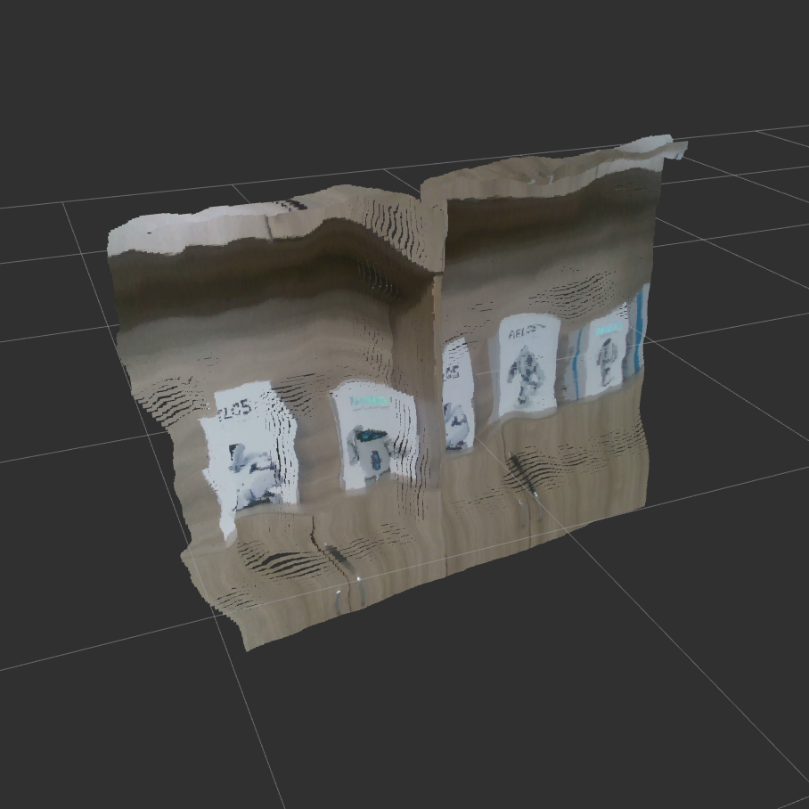
## 1.3 结果分析
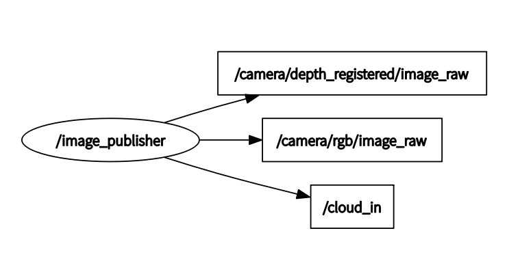

到此为止，我们便创建了`image_publisher`节点并把RGB图、深度图和点云图发布到ROS话题中以提供订阅。

# 2. Package: ORB-SLAM2
> ORB-SLAM2是一个服务于单目、双目和RGB-D相机的完整的SLAM系统，包括地图重用、闭环和重定位的功能。该系统可在各种环境中的标准CPU上实时工作，从小型手持室内序列到在工业环境中飞行的无人机以及在城市周围行驶的汽车。对于一个未知区域，该系统能从视觉上进行简单的定位以及测量追踪。
## 2.1 数据接收和程序初始化
ORB-SLAM2系统对于RGB-D相机的处理，采用了[光束法平差方法(BA)](http://www.cs.jhu.edu/~misha/ReadingSeminar/Papers/Triggs00.pdf)从而实现了精确度的最大化以及深度误差的最小化。其中可执行程序代码主体位于[ros_rgbd.cc](src/SLAM/ORB_SLAM2/Examples/ROS/ORB_SLAM2/src/ros_rgbd.cc)文件中。在数据处理之前，我们需要调整Realsense D435相机在文件[rgbd.yaml](utils/rgbd.yaml)中的参数。以下是具体的参数以及获取方法（也可以相机标定时直接过得.yaml文件）：

```
    # 可以通过img_publisher获取相机内参、外参以及图像的像素长宽
    # Camera calibration and distortion parameters (OpenCV) 
    Camera.fx: 606.437
    Camera.fy: 605.259
    Camera.cx: 318.563
    Camera.cy: 269.261
    Camera.width: 640
    Camera.height: 480

    # Camera frames per second 
    Camera.fps: 30.0

    # IR projector baseline times fx (aprox.)
    Camera.bf: 40.0
    # Color order of the images (0: BGR, 1: RGB. It is ignored if images are grayscale)
    Camera.RGB: 1

    # 通常是50，不需要改
    # Close/Far threshold. Baseline times.
    ThDepth: 50
    
    # 因为在传输时相机的比例为0.001,所以此处的深度系数要选择1000
    # Deptmap values factor 
    DepthMapFactor: 1000

    # 以下不需要改动
    #--------------------------------------------------------------------------------------------
    # ORB Parameters
    #--------------------------------------------------------------------------------------------

    # ORB Extractor: Number of features per image
    ORBextractor.nFeatures: 1000

    # ORB Extractor: Scale factor between levels in the scale pyramid      
    ORBextractor.scaleFactor: 1.2

    # ORB Extractor: Number of levels in the scale pyramid 
    ORBextractor.nLevels: 8

    # ORB Extractor: Fast threshold
    # Image is divided in a grid. At each cell FAST are extracted imposing a minimum response.
    # Firstly we impose iniThFAST. If no corners are detected we impose a lower value minThFAST
    # You can lower these values if your images have low contrast                  
    ORBextractor.iniThFAST: 20
    ORBextractor.minThFAST: 7

    #--------------------------------------------------------------------------------------------
    # Viewer Parameters
    #--------------------------------------------------------------------------------------------
    Viewer.KeyFrameSize: 0.05
    Viewer.KeyFrameLineWidth: 1
    Viewer.GraphLineWidth: 0.9
    Viewer.PointSize: 2
    Viewer.CameraSize: 0.08
    Viewer.CameraLineWidth: 3
    Viewer.ViewpointX: 0
    Viewer.ViewpointY: -0.7
    Viewer.ViewpointZ: -1.8
    Viewer.ViewpointF: 500


```
我们首先创建SLAM系统实例并初始化所有系统进程：
```
    // 创建SLAM系统实例并初始化所有的系统进程，做好处理帧的准备。
    ORB_SLAM2::System SLAM(argv[1],argv[2],ORB_SLAM2::System::RGBD,bUseViewer,bReuseMap);
```
ORB-SLAM2的进程主要包括1）TRACKING：通过找到各个帧之间的特征以定位相机位置并实行跟踪。2）LOCAL MAPPING：管理本地地图并进行优化（调用本地BA）。3）LOOP CLOSING：通过执行姿势图优化来检测大回路并校正累积的漂移。在`ORB_SLAM2::System`的构造函数中，有这三个进程的调用：
```
    //Initialize the Tracking thread
    //(it will live in the main thread of execution, the one that called this constructor)
    mpTracker = new Tracking(this, mpVocabulary, mpFrameDrawer, mpMapDrawer,
                             mpMap, mpPointCloudMapping, mpKeyFrameDatabase, strSettingsFile, mSensor, bReuse);

    //Initialize the Local Mapping thread and launch
    mpLocalMapper = new LocalMapping(mpMap, mSensor==MONOCULAR);
    mptLocalMapping = new thread(&ORB_SLAM2::LocalMapping::Run,mpLocalMapper);

    //Initialize the Loop Closing thread and launch
    mpLoopCloser = new LoopClosing(mpMap, mpKeyFrameDatabase, mpVocabulary, mSensor!=MONOCULAR);
    mptLoopClosing = new thread(&ORB_SLAM2::LoopClosing::Run, mpLoopCloser);
```
接下来通过ROS消息接收RGB图和深度图，并调用`GrabRGBD`回调函数。此函数能够通过`cv::bridge`将ROS的消息类型转换为`cv::Mat`格式的图像数据并调用`ORB_SLAM2::System TrackRGBD()`函数开始处理：
```
    // Copy the ros image message to cv::Mat.
    cv_bridge::CvImageConstPtr cv_ptrRGB;
    try
    {
        cv_ptrRGB = cv_bridge::toCvShare(msgRGB);
    }
    catch (cv_bridge::Exception& e)
    {
        ROS_ERROR("cv_bridge exception: %s", e.what());
        return;
    }

    cv_bridge::CvImageConstPtr cv_ptrD;
    try
    {
        cv_ptrD = cv_bridge::toCvShare(msgD);
    }
    catch (cv_bridge::Exception& e)
    {
        ROS_ERROR("cv_bridge exception: %s", e.what());
        return;
    }
    cv::Mat pose = mpSLAM->TrackRGBD(cv_ptrRGB->image,cv_ptrD->image,cv_ptrRGB->header.stamp.toSec());
    PublishPose(pose);
```
## 2.2 点云地图创建/重用
我们需要选择拍摄并创建新地图还是重新调用地图。
#### 2.2.1 点云地图创建
当我们到一个新的环境中时，需要获取周围环境的地图并储存为pcd文件，此时我们执行语句最后选择`false`：
```
    rosrun SLAM RGBD utils/ORBvoc.bin utils/rgbd.yaml true false
```
此时在System类中，我们将创建新的地图变量：
```
    mpMap = new Map();
```
当RGB-D程序结束时，我们期望把所挑选出的关键帧打印成一个连续的点云地图。。在打印生成的点云图像时，我们应在文件[PointCloudMapping.cc](src/SLAM/ORB_SLAM2/src/PointCloudMapping.cc)的`generatePointCloud()`函数里面做好相应参数的调整：
```
    if (d < 0.05 || d > 20)
        continue;
```
以及在`PointCloudMapping`类的构造函数中，调整适当的树叶大小：
```
    this->resolution = 0.01;
```
期间，出现了在相机完成闭环时的段错误，是因为在`CorrectLoop()`中使用了一个叫`KeyFrameAndPose`的数据类型，这个数据结构中会创建`Eigen`对象，根据`Eigen`文档，调用`Eigen`对象的数据结构需要使用`Eigen`的字节对齐，所以在[LoopClosing.h](src/SLAM/ORB_SLAM2/include/LoopClosing.h)中，加入此宏定义语句：
```
class LoopClosing
{
public:

  EIGEN_MAKE_ALIGNED_OPERATOR_NEW // 加入此语句

    typedef pair<set<KeyFrame*>,int> ConsistentGroup; 
    ... ...
};
```
至此，我们便获得了清晰可见的点云图[pointcloud.pcd](pointcloud.pcd)，下图为办公室走廊以及办公桌附近的点云图演示：
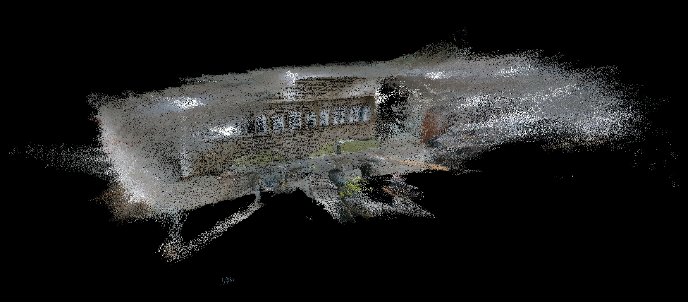
#### 2.2.1 点云地图重用（reuse）
当我们已经有当前环境的地图时，我们需要调用此地图，此时我们执行语句最后选择`true`：
```
    rosrun SLAM RGBD utils/ORBvoc.bin utils/rgbd.yaml true true
```
此时，在system的构造函数中进行原有地图的加载工作：
```	
    LoadMap("Slam_Map.bin");
    
    // mpKeyFrameDatabase->set_vocab(mpVocabulary);
    
    vector<ORB_SLAM2::KeyFrame*> vpKFs = mpMap->GetAllKeyFrames();
    for (vector<ORB_SLAM2::KeyFrame*>::iterator it = vpKFs.begin(); it != vpKFs.end(); ++it) {
        (*it)->SetKeyFrameDatabase(mpKeyFrameDatabase);
        (*it)->SetORBvocabulary(mpVocabulary);
        (*it)->SetMap(mpMap);
        (*it)->ComputeBoW();
        mpKeyFrameDatabase->add(*it);
        (*it)->SetMapPoints(mpMap->GetAllMapPoints());
        (*it)->SetSpanningTree(vpKFs);
        (*it)->SetGridParams(vpKFs);
        // Reconstruct map points Observation
    }

    vector<ORB_SLAM2::MapPoint*> vpMPs = mpMap->GetAllMapPoints();
    for (vector<ORB_SLAM2::MapPoint*>::iterator mit = vpMPs.begin(); mit != vpMPs.end(); ++mit) {
        (*mit)->SetMap(mpMap);
        (*mit)->SetObservations(vpKFs);
    }

    for (vector<ORB_SLAM2::KeyFrame*>::iterator it = vpKFs.begin(); it != vpKFs.end(); ++it) {
        (*it)->UpdateConnections();
    }
```
## 2.3 当前位置坐标的发布
无论是地图创建模式还是重用模式，在程序运行时都会实时地发布当前位置坐标。获取当前位置的代码主要在`ImageGrabber::PublishPose`函数中：
```
    void ImageGrabber::PublishPose(cv::Mat Tcw)
    {
        static tf::TransformBroadcaster mTfBr;
        geometry_msgs::PoseWithCovarianceStamped poseMSG;

        if(!Tcw.empty())
        {
            cv::Mat Rwc = Tcw.rowRange(0,3).colRange(0,3).t();
            cv::Mat twc = -Rwc*Tcw.rowRange(0,3).col(3);
            Eigen::Matrix<double,3,3> eigenRwc = ORB_SLAM2::Converter::toMatrix3d(Rwc);
            Eigen::Vector3d angles = eigenRwc.eulerAngles(2,0,1);

            tf::Quaternion Q;
            Q.setRPY(angles[0],-angles[1],-angles[2]);
            tf::Vector3 V(twc.at<float>(2), -twc.at<float>(0), -twc.at<float>(1));
            tf::Transform tfTcw(Q, V);
            mTfBr.sendTransform(tf::StampedTransform(tfTcw,ros::Time::now(), "map", "base_link"));

            cout<<"rawx: "<<setprecision(4)<<twc.at<float>(0)<<setprecision(4)<<" rawy: "<<setprecision(4)<<twc.at<float>(1)<<" rawz: "<<twc.at<float>(2)<<endl;
            cout<<"newx: "<<setprecision(4)<<V.x()<<setprecision(4)<<" newy: "<<setprecision(4)<<V.y()<<" newz: "<<V.z()<<endl;
            // poseMSG.header.
            poseMSG.pose.pose.position.x = V.x();
            poseMSG.pose.pose.position.y = V.y();
            poseMSG.pose.pose.position.z = V.z();
            poseMSG.pose.pose.orientation.x = Q.x();
            poseMSG.pose.pose.orientation.y = Q.y();
            poseMSG.pose.pose.orientation.z = Q.z();
            poseMSG.pose.pose.orientation.w = Q.w();
            poseMSG.header.frame_id = "map";
            poseMSG.header.stamp = ros::Time::now();
            (pPosPub)->publish(poseMSG);

        }
    }
    
    ...
    // main

    ros::Publisher PosPub = nh.advertise<geometry_msgs::PoseWithCovarianceStamped>("initialpose", 5);
    ....
```
我们获取并将带有时间戳的实时位置以geometry_msgs::PoseWithCovarianceStamped的消息类型发布出去。
## 2.4 结果分析
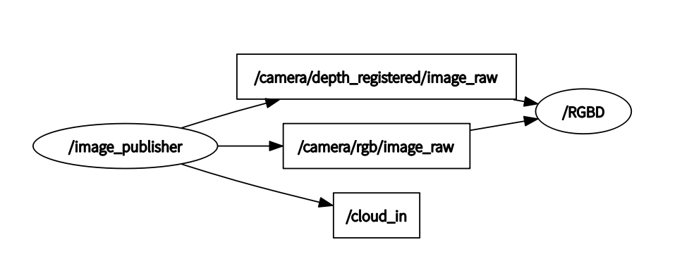
到此为止，我们将`image_publisher`节点发布的RGB图以及深度图进行处理，得到了pcd文件以及实时地发布当前位置坐标。
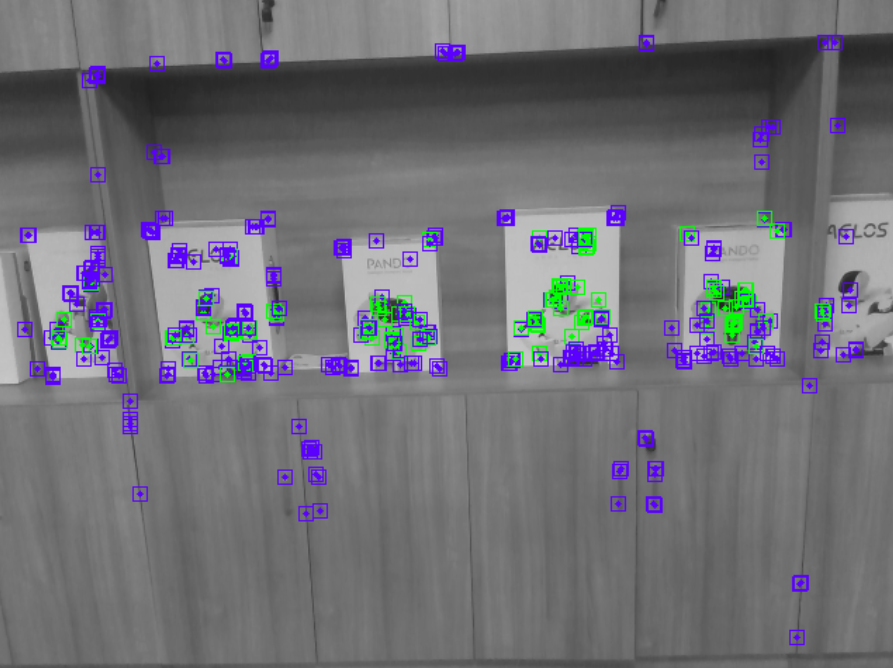
在RGB图片中，紫色的点代表原来地图上已经有的关键点，绿色的点代表重新识别出来的关键点。
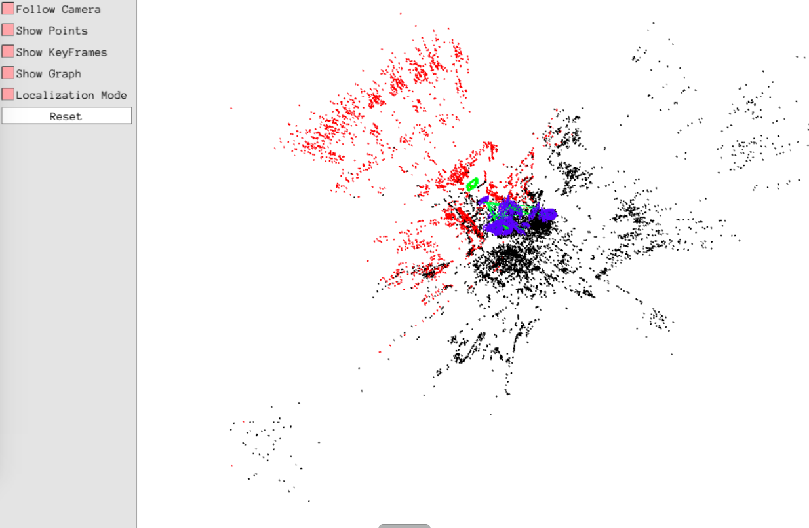
在点云图中，绿色的方框代表当前位置，红色的点云代表当前RGB图像在点云图上的位置，黑色的点代表已经识别的点云。

# 3. Package: octomap_sever
> [octomap_sever](http://wiki.ros.org/octomap_server)能加载3D地图，并以紧凑的二进制格式将其分发到其他节点。它还允许增量构建3D OctoMaps，并在节点octomap_saver中提供地图保存。
## 3.1 八叉树图层的截取
为了方便系统存储和处理，使用[八叉树](https://blog.csdn.net/Augusdi/article/details/36001543?utm_medium=distribute.pc_relevant.none-task-blog-BlogCommendFromMachineLearnPai2-1.nonecase&depth_1-utm_source=distribute.pc_relevant.none-task-blog-BlogCommendFromMachineLearnPai2-1.nonecase)的方法进行数学建模，大大减小了系统的存储空间以及缩短了处理时长。借助octomap_sever中的静态八叉树追踪的[roslaunch](src/octomap_server/launch/static-octomap_tracking_server.launch)，我们可以直接将点云的二进制文件转化成八叉树：
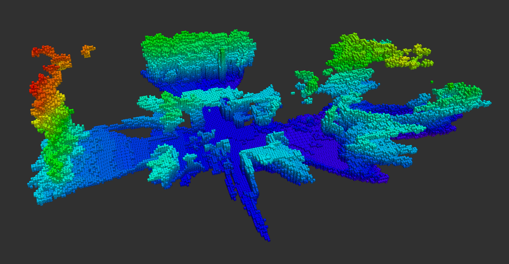
在转换的过程中需要自行配置参数，以截取合适的图层。例如，通过考虑机器人的身高以及去出地面的影响，我们所选的roslaunch参数如下所示：
```
    <param name="occupancy_max_z" value="0.11"/>
    <param name="occupancy_min_z" value="-0.41"/>
```
## 3.2 结果分析
截取后如下图所示：
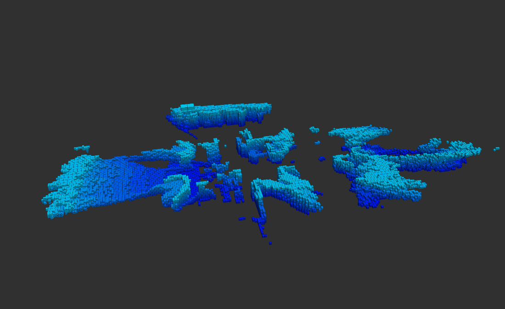
此后我们便可以得到理想的二维平面图：
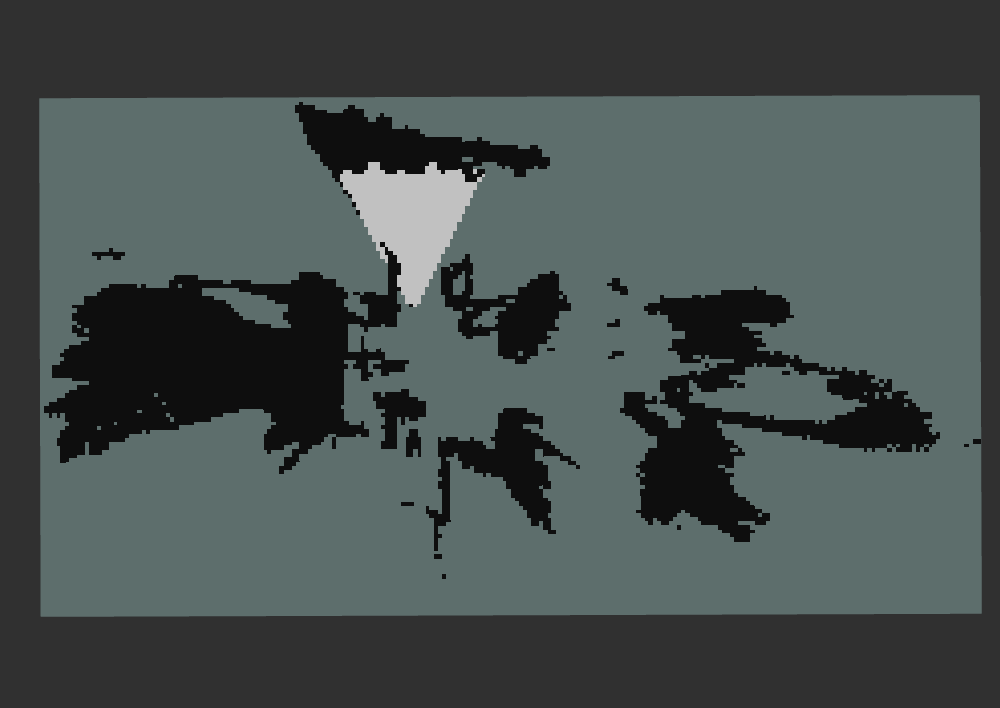
图中黑色部分代表不可进入的区域，白色部分代表镜头朝向（由于加载的是静态地图，此区域不会随着当前镜头的移动而改变，是又创建地图时最后的镜头位置所决定的），深绿色部分代表可以进入的区域。至此，变得到了可以分析路径的平面地图，同时地图`/map`由`octomap_talker`节点发出：
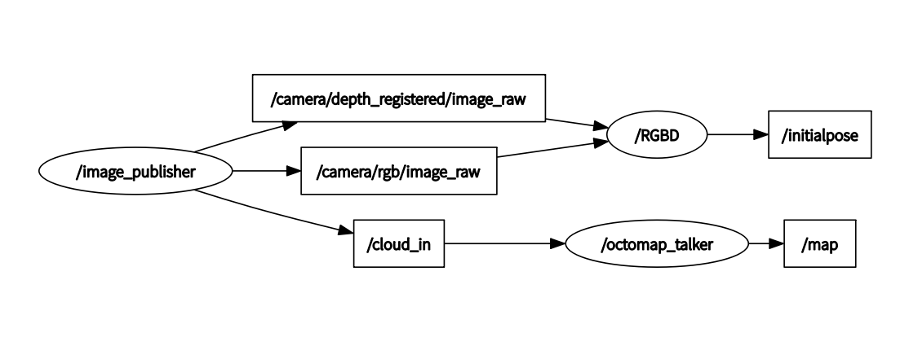

# 4. Package: humanoid_planner_2d
> 此package能接收当前位置信息`/initialpose`、二维的平面图`/map`以及给定的目标点`/move_base_simple/goal`，然后根据这些信息将到达目标点最短的路径画出来。
实现结果如下图所示：
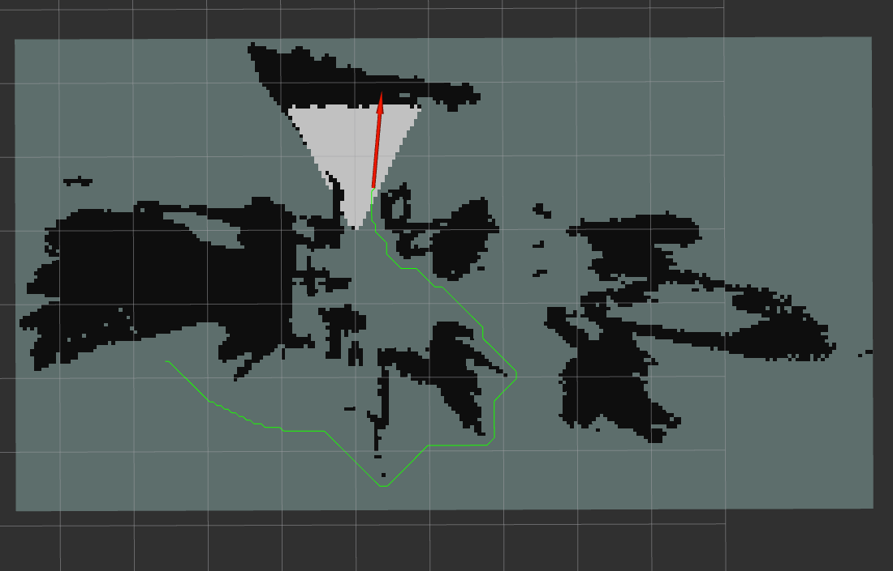
但是，在实际运行时发现，当机器人行走经过障碍物时，如果按照当前路径——只追求路径最短而太靠近障碍物，会导致机器人不能较好的躲避障碍物。所以我们希望机器人经过路径最短的前提下，尽量远离障碍物。因此，我们需要把可以经过的部分按照距离障碍物的远近计算权重，距离障碍物越近，权重就越大。以下是代码的核心部分：
```
    ...
    const int SHADOW_RADIUS = 8;
    ...

    //将本地地图初始化
    for(unsigned int j = 0; j < mapHeight; ++j)
        for(unsigned int i = 0; i < mapWidth; ++i)
            GridLocal[i][j]=0;
    //将地图划分权重
    for(unsigned int j = 0; j < mapHeight; ++j){
        for(unsigned int i = 0; i < mapWidth; ++i){
            if (map_->isOccupiedAtCell(i,j)) {
                GridLocal[i][j]=OBSTACLE_COST;
                for(int k = 0; k < SHADOW_RADIUS; k++) {
                    if((i-k >= 0) && (i-k < mapWidth) && (map_->isOccupiedAtCell(i-k,j))==false) {
                        GridLocal[i-k][j] += (SHADOW_RADIUS-k);
                        if(GridLocal[i-k][j]>=SHADOW_RADIUS)
                            GridLocal[i-k][j]=SHADOW_RADIUS;
                    }

                    if((i+k >= 0) && (i+k < mapWidth) && (map_->isOccupiedAtCell(i+k,j))==false) {
                        GridLocal[i+k][j]+=SHADOW_RADIUS-k;
                        if(GridLocal[i+k][j]>=SHADOW_RADIUS)
                            GridLocal[i+k][j]=SHADOW_RADIUS;
                    }

                    if((j-k >= 0) && (j-k < mapHeight) && (map_->isOccupiedAtCell(i,j-k))==false) {
                        GridLocal[i][j-k]+=SHADOW_RADIUS-k;
                        if(GridLocal[i][j-k]>=SHADOW_RADIUS)
                            GridLocal[i][j-k]=SHADOW_RADIUS;
                    }

                    if((j+k >= 0) && (j+k < mapHeight) && (map_->isOccupiedAtCell(i,j+k))==false) {
                        GridLocal[i][j+k]+=SHADOW_RADIUS-k;
                        if(GridLocal[i][j+k]>=SHADOW_RADIUS)
                            GridLocal[i][j+k]=SHADOW_RADIUS;
                    }
                }
            }
        }
    }
```
首先我们先设定一个常量`SHADOW_RADIUS`，字面意思，这代表地图障碍物所能影响到的范围。我们从地图的（0,0）位置开始，以此对地图像素点进行分析。若此点已被占用，我们则给他赋值为`OBSTACLE_COST（障碍物）`。接着，我们便从此点出发以`SHADOW_RADIUS`的距离范围向上下左右四个方向进行迭代，次数为设定的影子半径：若在影子范围内仍然是障碍物，则不做处理；反之，则根据距离起始点的距离设定权重——距离越近，权重越大。结果显而易见，当通过两个障碍物的过道时候，必然会从中间穿过以保证机器人所经过路径为权重最小的。下图为实际设计的路径效果图：
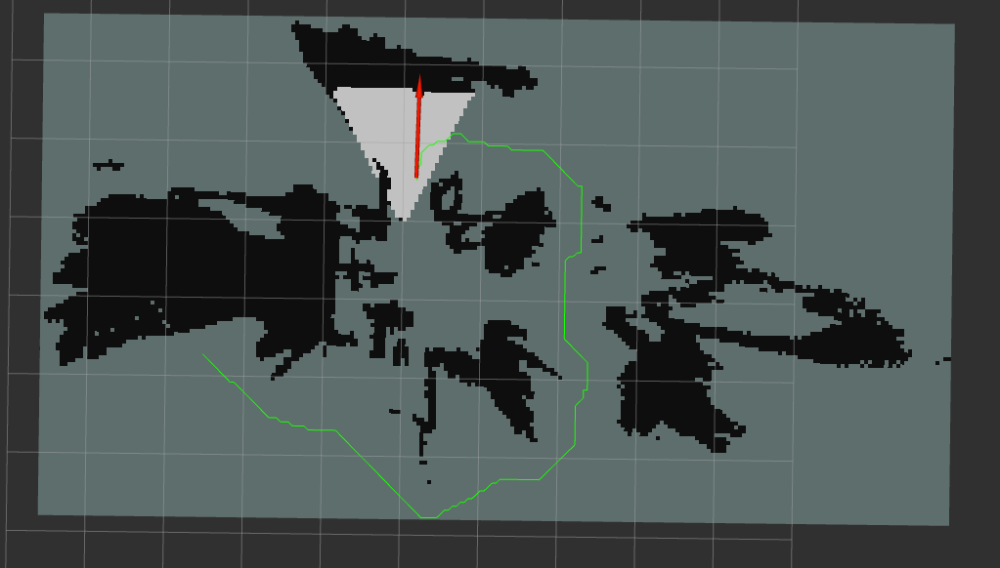
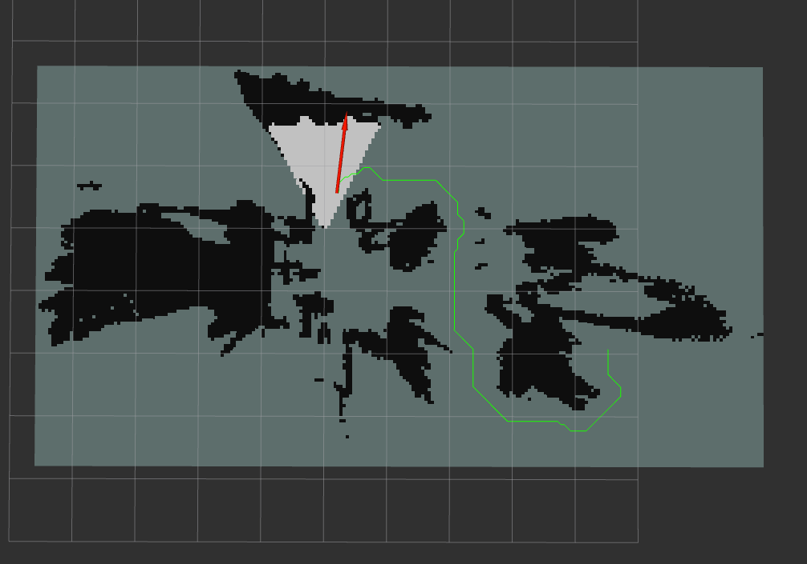

# 附录
## 1. Package: img_publisher
* [ORB-SLAM2稠密点云重建:RGBD室内](https://blog.csdn.net/qq_41524721/article/details/79126062)
* [realsense_camera.cpp](https://github.com/abhishek098/realsense_camera_wrapper/blob/master/src/realsense_camera_wrapper/realsense_camera.cpp)
* [Sample Code for Intel® RealSense™ cameras](https://dev.intelrealsense.com/docs/code-samples)
* [realsense SDK2.0学习：：（一）读取D435视频【彩色&&深度】](https://blog.csdn.net/dieju8330/article/details/85272800)
* [realsense SDK2.0学习：：（二）D435深度图片对齐到彩色图片-SDK实现](https://blog.csdn.net/dieju8330/article/details/85272919?utm_medium=distribute.pc_relevant.none-task-blog-baidujs-2)
## 2. Package: SLAM
* [ORB-SLAM2](https://github.com/raulmur/ORB_SLAM2)
* [gaoxiang12/octomap_tutor](https://github.com/gaoxiang12/octomap_tutor)
* [高翔博士-博客园](https://www.cnblogs.com/gaoxiang12/)
* [qq_41524721的博客 ORB-SLAM2](https://blog.csdn.net/qq_41524721/category_7590407.html)
* [[Stereo and RGB-D] Raúl Mur-Artal and Juan D. Tardós. ORB-SLAM2: an Open-Source SLAM System for Monocular, Stereo and RGB-D Cameras. IEEE Transactions on Robotics, vol. 33, no. 5, pp. 1255-1262, 2017.](https://128.84.21.199/pdf/1610.06475.pdf)
* [RealSense_Depth_D435i_IMU_Calib.pdf](https://www.intel.com/content/dam/support/us/en/documents/emerging-technologies/intel-realsense-technology/RealSense_Depth_D435i_IMU_Calib.pdf)
* [ORB_SLAM2 闭环检测段错误](https://blog.csdn.net/weixin_30746117/article/details/95196275)
## 3. Others
* [octomap_sever](http://wiki.ros.org/octomap_server)
* [Octomap 在ROS环境下实时显示](https://blog.csdn.net/crp997576280/article/details/74605766)
* [ROS stack with footstep planning and localization for humanoid robots](https://github.com/AravindaDP/humanoid_navigation)
# Q
1. realsense1和realsense2区别
2. realsense2直接获取相机内参？
