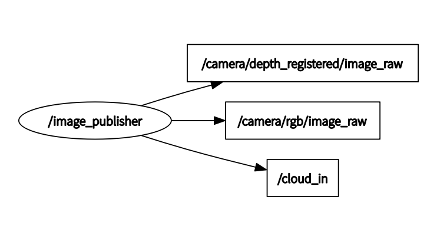
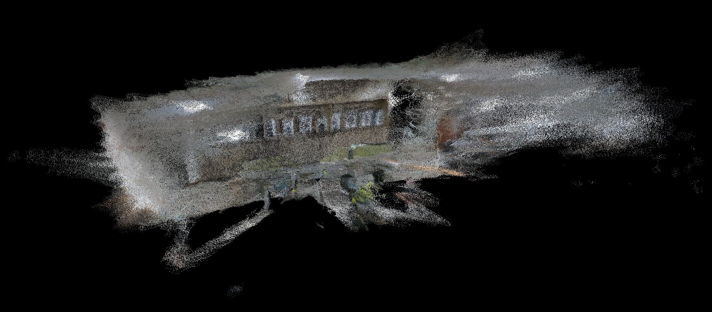
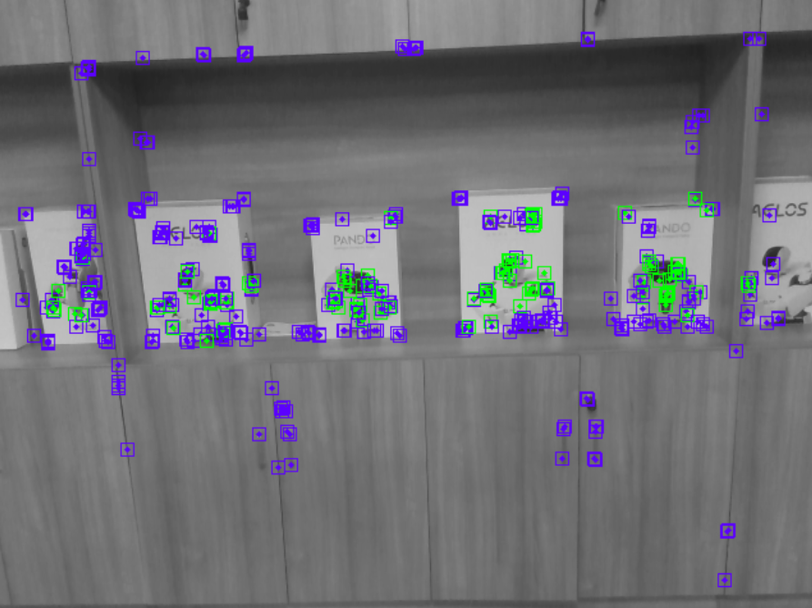
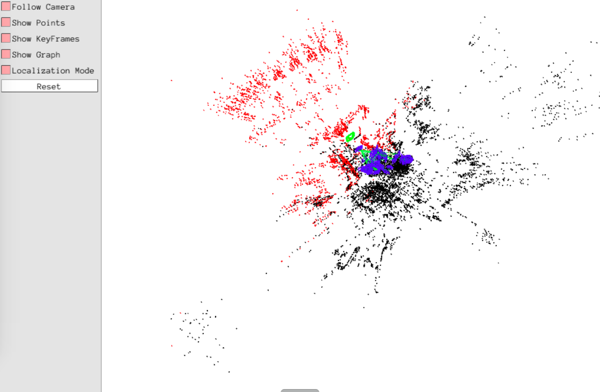
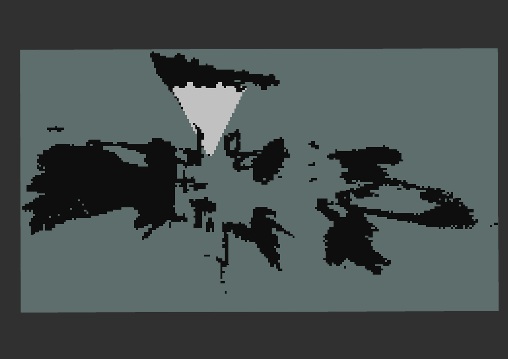
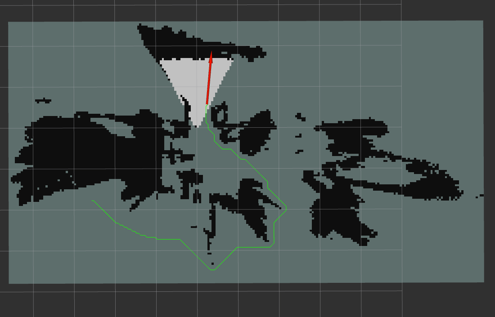
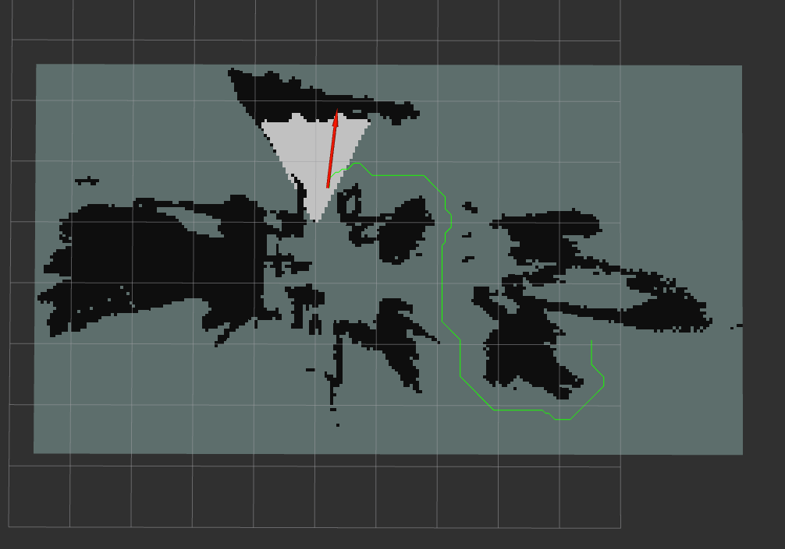

<!-- @author Hao SUN -->

Worker Internship Report 2020
===========================
Version 1.0
---------------------------

* Intel Realsense SDK2.0
* ubuntu 16.04 LTS
* Intel® Core™ i7-5500U CPU @ 2.40GHz × 4 
* Intel® Realsense D435

# Table of contents
* [Table of contents](#Table-of-contents)
* [Package: img_publisher](#1.-Package-img_publisher)
* [Package: SLAM](#2.-Package:-SLAM)
* [Package: octomap_sever](#3.-Package:-octomap_sever)
* [Package: humanoid_planner_2d](#4.-Package:-humanoid_planner_2d)
* [Appendix](#Appendix)
# 1. Package img_publisher
> The `img_publisher` Package allows you to analyze the data received transmitted by the D435 camera. It can align RGB images and depth images. `cv::cv_bridge` will transform picture type `cv::Mat` to ROS message type `sensor_msgs::ImagePtr` and then send them. It can also create the point cloud message `pcl::PointCloud<PointT>` of current coordinate system through real-time calculation of the camera data. Two pictures' datas and the point cloud data will be published through the node in the form of ROS message. The parts Some important parties of the codes are in the file [publisher.cpp](src/img_publisher/src/publisher.cpp).
## 1.1 Initialization and configuration
Before the `main()` function start, we should initialize some functions, variables as well as configure the camera and ROS.
### 1.1.1 Declaration and initialization of some functions and parameters
Here's the code of the declaration of the functions, the initialization of some variables and the typedefine of point cloud.
```
    // la fréquence de réception de caméra
    #define FPS 30

    typedef pcl::PointXYZRGB PointT;
    typedef pcl::PointCloud<PointT> PointCloud;

    // Obtenez la conversion d'unité de longueur correspondant au pixel de profondeur
    float get_depth_scale(rs2::device dev);
    // Vérifiez si le paramètre du pipeline de données de la caméra est modifié
    bool profile_changed(const std::vector<rs2::stream_profile>& current, const std::vector<rs2::stream_profile>& prev);

    float m_invalid_depth_value_ = 0.0;
    float m_max_z_ = 8.0;
```
### 1.1.2 Camera pipeline configuration and alignment from depth image to RGB image
As `realsense SDK2.0`, the RGB frame and depth frame must be taken frome the pipeline. So at the beginning of the codes, we configure two data stream: one is a 16-bit single-channel depth data stream and another is an 8-bit three-channel RGB data stream, of cause with a 30Hz receive frequence.
```
    // create a pipeline and configuration of pipeline
    rs2::pipeline pipe;
    rs2::config p_config;

    // configurer the pipeline and start the camera
    p_config.enable_stream(RS2_STREAM_DEPTH, 640, 480, RS2_FORMAT_Z16, FPS);
    p_config.enable_stream(RS2_STREAM_COLOR, 640, 480, RS2_FORMAT_RGB8, FPS);
    rs2::pipeline_profile profile = pipe.start(p_config);
```
Because of the difference of the depth pixel unit of different depth camera, we can get it from here:
```
    // use data pipeline profile to get the scale of depth image pixels corresponding to length units(meters).
    float depth_scale = get_depth_scale(profile.get_device());
```
By the way, we need to declare a variable `align` of type `rs2::align` which can align the depth image to the other images. And we will also use this variable realize the alignement of depth frame.
```
    rs2_stream align_to = RS2_STREAM_COLOR; 
    rs2::align align(align_to);
```
### 1.1.3 Camera intrinsics/extrinsics parameters acquisition 
In `realsense SDK2.0`, it existe the interfaces that can get directly get camera intrinsics/extrinsics parameters.
```
    // declare
    auto depth_stream = profile.get_stream(RS2_STREAM_DEPTH).as<rs2::video_stream_profile>();
    auto color_stream = profile.get_stream(RS2_STREAM_COLOR).as<rs2::video_stream_profile>();

    // acquire depth camera intrinsics parameters
    rs2_intrinsics m_depth_intrinsics_ = depth_stream.get_intrinsics();
    
    // acquire RGB camera intrinsics parameters
    rs2_intrinsics m_color_intrinsics_ = color_stream.get_intrinsics();
    
    // acquire RGB camera extrinsics parameters
    rs2_extrinsics  m_depth_2_color_extrinsics_ = depth_stream.get_extrinsics_to(color_stream);
    
    // acquire the height and the width of RGB frame
    auto color_width_ = m_color_intrinsics_.width;
    auto color_height_ = m_color_intrinsics_.height;
```
### 1.1.4 ROS related configuration
```
    ros::init(argc, argv, "image_publisher");

    // ROS node declaration
    ros::NodeHandle nh;
    image_transport::ImageTransport it(nh);
    image_transport::Publisher rgbPub = it.advertise("camera/rgb/image_raw", 1);
    image_transport::Publisher depthPub = it.advertise("camera/depth_registered/image_raw", 1);
    ros::Publisher pointcloud_publisher_ = nh.advertise<sensor_msgs::PointCloud2>("cloud_in", 1);
    
    // Image message statement
    sensor_msgs::ImagePtr rgbMsg, depthMsg;
    std_msgs::Header imgHeader = std_msgs::Header();
    // Point cloud message statement
    PointCloud::Ptr pointcloud_ = boost::make_shared< PointCloud >( );
    sensor_msgs::PointCloud2 msg_pointcloud;
```
## 1.2 Main function realization
Due to the need to continuously obtain camera data in real time, we put the main function code in a while loop and out of the loop only when the node is closed.
### 1.2.1 Frame acquisition and depth frame alignment
When there is RGB frames recieved, the function `wait_for_frames()` return these frames into variable `frameset`. Then we will obtain the RGB image frames and the depth image frames.`align` aligns the depth image to the RGB image and also gets the variable `processed` after alignment.
*Attention. if you add the color filter `apply_filter (rs2::colorizer c)` at this time, you can directly see the color and depth image in RVIZ, but if you send this image to RGB-D, you can’t get an ideal point cloud map.*
```
    rs2::frameset frameset = pipe.wait_for_frames();

    const rs2::frame &color_frame = frameset.get_color_frame();
    const rs2::frame &depth_frame = frameset.get_depth_frame();

    auto color_format_ = color_frame.as<rs2::video_frame>().get_profile().format();
    auto swap_rgb_ = color_format_ == RS2_FORMAT_BGR8 || color_format_ == RS2_FORMAT_BGRA8;
    auto nb_color_pixel_ = (color_format_ == RS2_FORMAT_RGB8 || color_format_ == RS2_FORMAT_BGR8) ? 3 : 4;

    // Because rs2 :: align is aligning the depth image to other image streams, we need to ensure that the aligned image stream does not change
    if (profile_changed(pipe.get_active_profile().get_streams(), profile.get_streams()))
    {
        std::cout<<"changed?"<<std::endl;
        //If the profile changes, update the align object and reacquire the conversion ratio of depth image pixels to length units
        profile = pipe.get_active_profile();
        align = rs2::align(align_to);
        depth_scale = get_depth_scale(profile.get_device());
    }

    // Get aligned frames
    rs2::frameset processed = align.process(frameset);

    // Try to get the aligned depth image frame and other frames
    rs2::frame aligned_color_frame = processed.get_color_frame();
    rs2::frame aligned_depth_frame = processed.get_depth_frame(); // apply_filter(c)

    // Get the width and height of the image
    const int depth_w = aligned_depth_frame.as<rs2::video_frame>().get_width();
    const int depth_h = aligned_depth_frame.as<rs2::video_frame>().get_height();
    const int color_w = aligned_color_frame.as<rs2::video_frame>().get_width();
    const int color_h = aligned_color_frame.as<rs2::video_frame>().get_height();
```
### 1.2.2 RGB/depth image message publish
When the two imaged are ready, the RGB image is published by an 8-bit three-channel(CV_8UC3) named `rgb8`, and the depth image is published by a 16-bit single-channel(CV_16UC1) named `16UC1`.
```
    // get the time stamp
    imgHeader.stamp = ros::Time::now();

    // RGB image
    cv::Mat aligned_color_image(cv::Size(color_w,color_h), CV_8UC3, (void*)aligned_color_frame.get_data(), cv::Mat::AUTO_STEP);
    rgbMsg = cv_bridge::CvImage(imgHeader, "rgb8", aligned_color_image).toImageMsg();
    rgbPub.publish(rgbMsg);
    
    // depth image
    cv::Mat aligned_depth_image(cv::Size(depth_w,depth_h), CV_16UC1, (void*)aligned_depth_frame.get_data(), cv::Mat::AUTO_STEP);
    depthMsg = cv_bridge::CvImage(imgHeader, "16UC1", aligned_depth_image).toImageMsg();
    depthPub.publish(depthMsg);

```

Exemple of RGb & depth image:  

### 1.2.3 Point cloud image message publish
The point cloud image is generated based on the function `rs2_deproject_pixel_to_point()`. We can find the pinhole camera tramsfer matrix in it. After the position coordinates and the color coordinated are assigned, we will get the colorized point cloud.
```
    // Point cloud
    rs2::video_frame vf = aligned_depth_frame.as<rs2::video_frame>();

    const int width = vf.get_width();
    const int height = vf.get_height();
    pointcloud_->width = (uint32_t)width;
    pointcloud_->height = (uint32_t)height;
    pointcloud_->resize((size_t)(width * height));

    const uint16_t *p_depth_frame = reinterpret_cast<const uint16_t *>(aligned_depth_frame.get_data());
    const unsigned char *p_color_frame = reinterpret_cast<const unsigned char *>(aligned_color_frame.get_data());

    for (int i = 0; i < height; i++)
    {
        auto depth_pixel_index = i * width;
        for (int j = 0; j < width; j++, depth_pixel_index++)
        {
            if (p_depth_frame[depth_pixel_index] == 0)
            {
                pointcloud_->points[(size_t)depth_pixel_index].x = m_invalid_depth_value_;
                pointcloud_->points[(size_t)depth_pixel_index].y = m_invalid_depth_value_;
                pointcloud_->points[(size_t)depth_pixel_index].z = m_invalid_depth_value_;
            }

            // Get the depth value of the current pixel
            auto pixels_distance =  depth_scale *p_depth_frame[depth_pixel_index];
            float depth_point[3];
            const float pixel[] = {(float)j, (float)i};

            rs2_deproject_pixel_to_point(depth_point, &m_depth_intrinsics_, pixel, pixels_distance);
            
            if (pixels_distance > m_max_z_)
                depth_point[0] = depth_point[1] = depth_point[2] = m_invalid_depth_value_;

            pointcloud_->points[(size_t)depth_pixel_index].x = depth_point[2];
            pointcloud_->points[(size_t)depth_pixel_index].y = -depth_point[0];
            pointcloud_->points[(size_t)depth_pixel_index].z = -depth_point[1];

            float color_point[3];
            rs2_transform_point_to_point(color_point, &m_depth_2_color_extrinsics_, depth_point);
            float color_pixel[2];
            rs2_project_point_to_pixel(color_pixel, &m_color_intrinsics_, color_point);

            if (color_pixel[1] < 0 || color_pixel[1] >= color_height_ || color_pixel[0] < 0 || color_pixel[0] >= color_width_)
            {
                pointcloud_->points[(size_t)depth_pixel_index].x = m_invalid_depth_value_;
                pointcloud_->points[(size_t)depth_pixel_index].y = m_invalid_depth_value_;
                pointcloud_->points[(size_t)depth_pixel_index].z = m_invalid_depth_value_;
            }
            else
            {
                unsigned int i_ = (unsigned int)color_pixel[1];
                unsigned int j_ = (unsigned int)color_pixel[0];
                if (swap_rgb_)
                {
                    pointcloud_->points[(size_t)depth_pixel_index].b =
                        (uint32_t)p_color_frame[(i_ * (unsigned int)color_width_ + j_) * nb_color_pixel_];
                    pointcloud_->points[(size_t)depth_pixel_index].g =
                        (uint32_t)p_color_frame[(i_ * (unsigned int)color_width_ + j_) * nb_color_pixel_ + 1];
                    pointcloud_->points[(size_t)depth_pixel_index].r =
                        (uint32_t)p_color_frame[(i_ * (unsigned int)color_width_ + j_) * nb_color_pixel_ + 2];
                }
                else
                {
                    pointcloud_->points[(size_t)depth_pixel_index].r =
                        (uint32_t)p_color_frame[(i_ * (unsigned int)color_width_ + j_) * nb_color_pixel_];
                    pointcloud_->points[(size_t)depth_pixel_index].g =
                        (uint32_t)p_color_frame[(i_ * (unsigned int)color_width_ + j_) * nb_color_pixel_ + 1];
                    pointcloud_->points[(size_t)depth_pixel_index].b =
                        (uint32_t)p_color_frame[(i_ * (unsigned int)color_width_ + j_) * nb_color_pixel_ + 2];
                }

            }
        }
    }
    pcl::toROSMsg(*pointcloud_, msg_pointcloud);
    msg_pointcloud.header.stamp = imgHeader.stamp;
    msg_pointcloud.is_dense = true;
    msg_pointcloud.header.frame_id = "map";

    pointcloud_publisher_.publish(msg_pointcloud);
    pointcloud_ ->clear();
    ros::spinOnce();
```
Exemple of point cloud:  

## 1.3 Result analysis


到此为止，我们便创建了`image_publisher`节点并把RGB图、深度图和点云图发布到ROS话题中以提供订阅。

# 2. Package: SLAM
> ORB-SLAM2是一个服务于单目、双目和RGB-D相机的完整的SLAM系统，包括地图重用、闭环和重定位的功能。该系统可在各种环境中的标准CPU上实时工作，从小型手持室内序列到在工业环境中飞行的无人机以及在城市周围行驶的汽车。对于一个未知区域，该系统能从视觉上进行简单的定位以及测量追踪。
## 2.1 数据接收和程序初始化
ORB-SLAM2系统对于RGB-D相机的处理，采用了[光束法平差方法(BA)](http://www.cs.jhu.edu/~misha/ReadingSeminar/Papers/Triggs00.pdf)从而实现了精确度的最大化以及深度误差的最小化。其中可执行程序代码主体位于[ros_rgbd.cc](src/SLAM/ORB_SLAM2/Examples/ROS/ORB_SLAM2/src/ros_rgbd.cc)文件中。在数据处理之前，我们需要调整Realsense D435相机在文件[rgbd.yaml](utils/rgbd.yaml)中的参数。以下是具体的参数以及获取方法（也可以相机标定时直接过得.yaml文件）：

```
    # 可以通过img_publisher获取相机内参、外参以及图像的像素长宽
    # Camera calibration and distortion parameters (OpenCV) 
    Camera.fx: 606.437
    Camera.fy: 605.259
    Camera.cx: 318.563
    Camera.cy: 269.261
    Camera.width: 640
    Camera.height: 480

    # Camera frames per second 
    Camera.fps: 30.0

    # IR projector baseline times fx (aprox.)
    Camera.bf: 40.0
    # Color order of the images (0: BGR, 1: RGB. It is ignored if images are grayscale)
    Camera.RGB: 1

    # 通常是50，不需要改
    # Close/Far threshold. Baseline times.
    ThDepth: 50
    
    # 因为在传输时相机的比例为0.001,所以此处的深度系数要选择1000
    # Deptmap values factor 
    DepthMapFactor: 1000

    # 以下不需要改动
    #--------------------------------------------------------------------------------------------
    # ORB Parameters
    #--------------------------------------------------------------------------------------------

    # ORB Extractor: Number of features per image
    ORBextractor.nFeatures: 1000

    # ORB Extractor: Scale factor between levels in the scale pyramid      
    ORBextractor.scaleFactor: 1.2

    # ORB Extractor: Number of levels in the scale pyramid 
    ORBextractor.nLevels: 8

    # ORB Extractor: Fast threshold
    # Image is divided in a grid. At each cell FAST are extracted imposing a minimum response.
    # Firstly we impose iniThFAST. If no corners are detected we impose a lower value minThFAST
    # You can lower these values if your images have low contrast                  
    ORBextractor.iniThFAST: 20
    ORBextractor.minThFAST: 7

    #--------------------------------------------------------------------------------------------
    # Viewer Parameters
    #--------------------------------------------------------------------------------------------
    Viewer.KeyFrameSize: 0.05
    Viewer.KeyFrameLineWidth: 1
    Viewer.GraphLineWidth: 0.9
    Viewer.PointSize: 2
    Viewer.CameraSize: 0.08
    Viewer.CameraLineWidth: 3
    Viewer.ViewpointX: 0
    Viewer.ViewpointY: -0.7
    Viewer.ViewpointZ: -1.8
    Viewer.ViewpointF: 500


```
我们首先创建SLAM系统实例并初始化所有系统进程：
```
    // 创建SLAM系统实例并初始化所有的系统进程，做好处理帧的准备。
    ORB_SLAM2::System SLAM(argv[1],argv[2],ORB_SLAM2::System::RGBD,bUseViewer,bReuseMap);
```
ORB-SLAM2的进程主要包括1）TRACKING：通过找到各个帧之间的特征以定位相机位置并实行跟踪。2）LOCAL MAPPING：管理本地地图并进行优化（调用本地BA）。3）LOOP CLOSING：通过执行姿势图优化来检测大回路并校正累积的漂移。在`ORB_SLAM2::System`的构造函数中，有这三个进程的调用：
```
    //Initialize the Tracking thread
    //(it will live in the main thread of execution, the one that called this constructor)
    mpTracker = new Tracking(this, mpVocabulary, mpFrameDrawer, mpMapDrawer,
                             mpMap, mpPointCloudMapping, mpKeyFrameDatabase, strSettingsFile, mSensor, bReuse);

    //Initialize the Local Mapping thread and launch
    mpLocalMapper = new LocalMapping(mpMap, mSensor==MONOCULAR);
    mptLocalMapping = new thread(&ORB_SLAM2::LocalMapping::Run,mpLocalMapper);

    //Initialize the Loop Closing thread and launch
    mpLoopCloser = new LoopClosing(mpMap, mpKeyFrameDatabase, mpVocabulary, mSensor!=MONOCULAR);
    mptLoopClosing = new thread(&ORB_SLAM2::LoopClosing::Run, mpLoopCloser);
```
接下来通过ROS消息接收RGB图和深度图，并调用`GrabRGBD`回调函数。此函数能够通过`cv::bridge`将ROS的消息类型转换为`cv::Mat`格式的图像数据并调用`ORB_SLAM2::System TrackRGBD()`函数开始处理：
```
    // Copy the ros image message to cv::Mat.
    cv_bridge::CvImageConstPtr cv_ptrRGB;
    try
    {
        cv_ptrRGB = cv_bridge::toCvShare(msgRGB);
    }
    catch (cv_bridge::Exception& e)
    {
        ROS_ERROR("cv_bridge exception: %s", e.what());
        return;
    }

    cv_bridge::CvImageConstPtr cv_ptrD;
    try
    {
        cv_ptrD = cv_bridge::toCvShare(msgD);
    }
    catch (cv_bridge::Exception& e)
    {
        ROS_ERROR("cv_bridge exception: %s", e.what());
        return;
    }
    cv::Mat pose = mpSLAM->TrackRGBD(cv_ptrRGB->image,cv_ptrD->image,cv_ptrRGB->header.stamp.toSec());
    PublishPose(pose);
```
## 2.2 点云地图创建/重用
我们需要选择拍摄并创建新地图还是重新调用地图。
#### 2.2.1 点云地图创建
当我们到一个新的环境中时，需要获取周围环境的地图并储存为pcd文件，此时我们执行语句最后选择`false`：
```
    rosrun SLAM RGBD utils/ORBvoc.bin utils/rgbd.yaml true false
```
此时在System类中，我们将创建新的地图变量：
```
    mpMap = new Map();
```
当RGB-D程序结束时，我们期望把所挑选出的关键帧打印成一个连续的点云地图。。在打印生成的点云图像时，我们应在文件[PointCloudMapping.cc](src/SLAM/ORB_SLAM2/src/PointCloudMapping.cc)的`generatePointCloud()`函数里面做好相应参数的调整：
```
    if (d < 0.05 || d > 20)
        continue;
```
以及在`PointCloudMapping`类的构造函数中，调整适当的树叶大小：
```
    this->resolution = 0.01;
```
期间，出现了在相机完成闭环时的段错误，是因为在`CorrectLoop()`中使用了一个叫`KeyFrameAndPose`的数据类型，这个数据结构中会创建`Eigen`对象，根据`Eigen`文档，调用`Eigen`对象的数据结构需要使用`Eigen`的字节对齐，所以在[LoopClosing.h](src/SLAM/ORB_SLAM2/include/LoopClosing.h)中，加入此宏定义语句：
```
class LoopClosing
{
public:

  EIGEN_MAKE_ALIGNED_OPERATOR_NEW // 加入此语句

    typedef pair<set<KeyFrame*>,int> ConsistentGroup; 
    ... ...
};
```
至此，我们便获得了清晰可见的点云图[pointcloud.pcd](pointcloud.pcd)，下图为办公室走廊以及办公桌附近的点云图演示：

#### 2.2.1 点云地图重用（reuse）
当我们已经有当前环境的地图时，我们需要调用此地图，此时我们执行语句最后选择`true`：
```
    rosrun SLAM RGBD utils/ORBvoc.bin utils/rgbd.yaml true true
```
此时，在system的构造函数中进行原有地图的加载工作：
```	
    LoadMap("Slam_Map.bin");
    
    // mpKeyFrameDatabase->set_vocab(mpVocabulary);
    
    vector<ORB_SLAM2::KeyFrame*> vpKFs = mpMap->GetAllKeyFrames();
    for (vector<ORB_SLAM2::KeyFrame*>::iterator it = vpKFs.begin(); it != vpKFs.end(); ++it) {
        (*it)->SetKeyFrameDatabase(mpKeyFrameDatabase);
        (*it)->SetORBvocabulary(mpVocabulary);
        (*it)->SetMap(mpMap);
        (*it)->ComputeBoW();
        mpKeyFrameDatabase->add(*it);
        (*it)->SetMapPoints(mpMap->GetAllMapPoints());
        (*it)->SetSpanningTree(vpKFs);
        (*it)->SetGridParams(vpKFs);
        // Reconstruct map points Observation
    }

    vector<ORB_SLAM2::MapPoint*> vpMPs = mpMap->GetAllMapPoints();
    for (vector<ORB_SLAM2::MapPoint*>::iterator mit = vpMPs.begin(); mit != vpMPs.end(); ++mit) {
        (*mit)->SetMap(mpMap);
        (*mit)->SetObservations(vpKFs);
    }

    for (vector<ORB_SLAM2::KeyFrame*>::iterator it = vpKFs.begin(); it != vpKFs.end(); ++it) {
        (*it)->UpdateConnections();
    }
```
## 2.3 当前位置坐标的发布
无论是地图创建模式还是重用模式，在程序运行时都会实时地发布当前位置坐标。获取当前位置的代码主要在`ImageGrabber::PublishPose`函数中：
```
    void ImageGrabber::PublishPose(cv::Mat Tcw)
    {
        static tf::TransformBroadcaster mTfBr;
        geometry_msgs::PoseWithCovarianceStamped poseMSG;

        if(!Tcw.empty())
        {
            cv::Mat Rwc = Tcw.rowRange(0,3).colRange(0,3).t();
            cv::Mat twc = -Rwc*Tcw.rowRange(0,3).col(3);
            Eigen::Matrix<double,3,3> eigenRwc = ORB_SLAM2::Converter::toMatrix3d(Rwc);
            Eigen::Vector3d angles = eigenRwc.eulerAngles(2,0,1);

            tf::Quaternion Q;
            Q.setRPY(angles[0],-angles[1],-angles[2]);
            tf::Vector3 V(twc.at<float>(2), -twc.at<float>(0), -twc.at<float>(1));
            tf::Transform tfTcw(Q, V);
            mTfBr.sendTransform(tf::StampedTransform(tfTcw,ros::Time::now(), "map", "base_link"));

            cout<<"rawx: "<<setprecision(4)<<twc.at<float>(0)<<setprecision(4)<<" rawy: "<<setprecision(4)<<twc.at<float>(1)<<" rawz: "<<twc.at<float>(2)<<endl;
            cout<<"newx: "<<setprecision(4)<<V.x()<<setprecision(4)<<" newy: "<<setprecision(4)<<V.y()<<" newz: "<<V.z()<<endl;
            // poseMSG.header.
            poseMSG.pose.pose.position.x = V.x();
            poseMSG.pose.pose.position.y = V.y();
            poseMSG.pose.pose.position.z = V.z();
            poseMSG.pose.pose.orientation.x = Q.x();
            poseMSG.pose.pose.orientation.y = Q.y();
            poseMSG.pose.pose.orientation.z = Q.z();
            poseMSG.pose.pose.orientation.w = Q.w();
            poseMSG.header.frame_id = "map";
            poseMSG.header.stamp = ros::Time::now();
            (pPosPub)->publish(poseMSG);

        }
    }
    
    ...
    // main

    ros::Publisher PosPub = nh.advertise<geometry_msgs::PoseWithCovarianceStamped>("initialpose", 5);
    ....
```
我们获取并将带有时间戳的实时位置以geometry_msgs::PoseWithCovarianceStamped的消息类型发布出去。
## 2.4 结果分析

到此为止，我们将`image_publisher`节点发布的RGB图以及深度图进行处理，得到了pcd文件以及实时地发布当前位置坐标。

在RGB图片中，紫色的点代表原来地图上已经有的关键点，绿色的点代表重新识别出来的关键点。

在点云图中，绿色的方框代表当前位置，红色的点云代表当前RGB图像在点云图上的位置，黑色的点代表已经识别的点云。

# 3. Package: octomap_sever
> [octomap_sever](http://wiki.ros.org/octomap_server)能加载3D地图，并以紧凑的二进制格式将其分发到其他节点。它还允许增量构建3D OctoMaps，并在节点octomap_saver中提供地图保存。
## 3.1 八叉树图层的截取
为了方便系统存储和处理，使用[八叉树](https://blog.csdn.net/Augusdi/article/details/36001543?utm_medium=distribute.pc_relevant.none-task-blog-BlogCommendFromMachineLearnPai2-1.nonecase&depth_1-utm_source=distribute.pc_relevant.none-task-blog-BlogCommendFromMachineLearnPai2-1.nonecase)的方法进行数学建模，大大减小了系统的存储空间以及缩短了处理时长。借助octomap_sever中的静态八叉树追踪的[roslaunch](src/octomap_server/launch/static-octomap_tracking_server.launch)，我们可以直接将点云的二进制文件转化成八叉树：

在转换的过程中需要自行配置参数，以截取合适的图层。例如，通过考虑机器人的身高以及去出地面的影响，我们所选的roslaunch参数如下所示：
```
    <param name="occupancy_max_z" value="0.11"/>
    <param name="occupancy_min_z" value="-0.41"/>
```
## 3.2 结果分析
截取后如下图所示：

此后我们便可以得到理想的二维平面图：

图中黑色部分代表不可进入的区域，白色部分代表镜头朝向（由于加载的是静态地图，此区域不会随着当前镜头的移动而改变，是又创建地图时最后的镜头位置所决定的），深绿色部分代表可以进入的区域。至此，变得到了可以分析路径的平面地图，同时地图`/map`由`octomap_talker`节点发出：


# 4. Package: humanoid_planner_2d
> 此package能接收当前位置信息`/initialpose`、二维的平面图`/map`以及给定的目标点`/move_base_simple/goal`，然后根据这些信息将到达目标点最短的路径画出来。
实现结果如下图所示：

但是，在实际运行时发现，当机器人行走经过障碍物时，如果按照当前路径——只追求路径最短而太靠近障碍物，会导致机器人不能较好的躲避障碍物。所以我们希望机器人经过路径最短的前提下，尽量远离障碍物。因此，我们需要把可以经过的部分按照距离障碍物的远近计算权重，距离障碍物越近，权重就越大。以下是代码的核心部分：
```
    ...
    const int SHADOW_RADIUS = 8;
    ...

    //将本地地图初始化
    for(unsigned int j = 0; j < mapHeight; ++j)
        for(unsigned int i = 0; i < mapWidth; ++i)
            GridLocal[i][j]=0;
    //将地图划分权重
    for(unsigned int j = 0; j < mapHeight; ++j){
        for(unsigned int i = 0; i < mapWidth; ++i){
            if (map_->isOccupiedAtCell(i,j)) {
                GridLocal[i][j]=OBSTACLE_COST;
                for(int k = 0; k < SHADOW_RADIUS; k++) {
                    if((i-k >= 0) && (i-k < mapWidth) && (map_->isOccupiedAtCell(i-k,j))==false) {
                        GridLocal[i-k][j] += (SHADOW_RADIUS-k);
                        if(GridLocal[i-k][j]>=SHADOW_RADIUS)
                            GridLocal[i-k][j]=SHADOW_RADIUS;
                    }

                    if((i+k >= 0) && (i+k < mapWidth) && (map_->isOccupiedAtCell(i+k,j))==false) {
                        GridLocal[i+k][j]+=SHADOW_RADIUS-k;
                        if(GridLocal[i+k][j]>=SHADOW_RADIUS)
                            GridLocal[i+k][j]=SHADOW_RADIUS;
                    }

                    if((j-k >= 0) && (j-k < mapHeight) && (map_->isOccupiedAtCell(i,j-k))==false) {
                        GridLocal[i][j-k]+=SHADOW_RADIUS-k;
                        if(GridLocal[i][j-k]>=SHADOW_RADIUS)
                            GridLocal[i][j-k]=SHADOW_RADIUS;
                    }

                    if((j+k >= 0) && (j+k < mapHeight) && (map_->isOccupiedAtCell(i,j+k))==false) {
                        GridLocal[i][j+k]+=SHADOW_RADIUS-k;
                        if(GridLocal[i][j+k]>=SHADOW_RADIUS)
                            GridLocal[i][j+k]=SHADOW_RADIUS;
                    }
                }
            }
        }
    }
```
首先我们先设定一个常量`SHADOW_RADIUS`，字面意思，这代表地图障碍物所能影响到的范围。我们从地图的（0,0）位置开始，以此对地图像素点进行分析。若此点已被占用，我们则给他赋值为`OBSTACLE_COST（障碍物）`。接着，我们便从此点出发以`SHADOW_RADIUS`的距离范围向上下左右四个方向进行迭代，次数为设定的影子半径：若在影子范围内仍然是障碍物，则不做处理；反之，则根据距离起始点的距离设定权重——距离越近，权重越大。结果显而易见，当通过两个障碍物的过道时候，必然会从中间穿过以保证机器人所经过路径为权重最小的。下图为实际设计的路径效果图：



# Appendix
## 1. Package: img_publisher
* [ORB-SLAM2稠密点云重建:RGBD室内](https://blog.csdn.net/qq_41524721/article/details/79126062)
* [realsense_camera.cpp](https://github.com/abhishek098/realsense_camera_wrapper/blob/master/src/realsense_camera_wrapper/realsense_camera.cpp)
* [Sample Code for Intel® RealSense™ cameras](https://dev.intelrealsense.com/docs/code-samples)
* [realsense SDK2.0学习：：（一）读取D435视频【彩色&&深度】](https://blog.csdn.net/dieju8330/article/details/85272800)
* [realsense SDK2.0学习：：（二）D435深度图片对齐到彩色图片-SDK实现](https://blog.csdn.net/dieju8330/article/details/85272919?utm_medium=distribute.pc_relevant.none-task-blog-baidujs-2)
## 2. Package: SLAM
* [ORB-SLAM2](https://github.com/raulmur/ORB_SLAM2)
* [gaoxiang12/octomap_tutor](https://github.com/gaoxiang12/octomap_tutor)
* [高翔博士-博客园](https://www.cnblogs.com/gaoxiang12/)
* [qq_41524721的博客 ORB-SLAM2](https://blog.csdn.net/qq_41524721/category_7590407.html)
* [[Stereo and RGB-D] Raúl Mur-Artal and Juan D. Tardós. ORB-SLAM2: an Open-Source SLAM System for Monocular, Stereo and RGB-D Cameras. IEEE Transactions on Robotics, vol. 33, no. 5, pp. 1255-1262, 2017.](https://128.84.21.199/pdf/1610.06475.pdf)
* [RealSense_Depth_D435i_IMU_Calib.pdf](https://www.intel.com/content/dam/support/us/en/documents/emerging-technologies/intel-realsense-technology/RealSense_Depth_D435i_IMU_Calib.pdf)
* [ORB_SLAM2 闭环检测段错误](https://blog.csdn.net/weixin_30746117/article/details/95196275)
## 3. Others
* [octomap_sever](http://wiki.ros.org/octomap_server)
* [Octomap 在ROS环境下实时显示](https://blog.csdn.net/crp997576280/article/details/74605766)
* [ROS stack with footstep planning and localization for humanoid robots](https://github.com/AravindaDP/humanoid_navigation)
# Q
1. realsense1和realsense2区别
2. realsense2直接获取相机内参？
